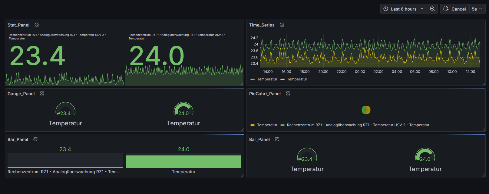
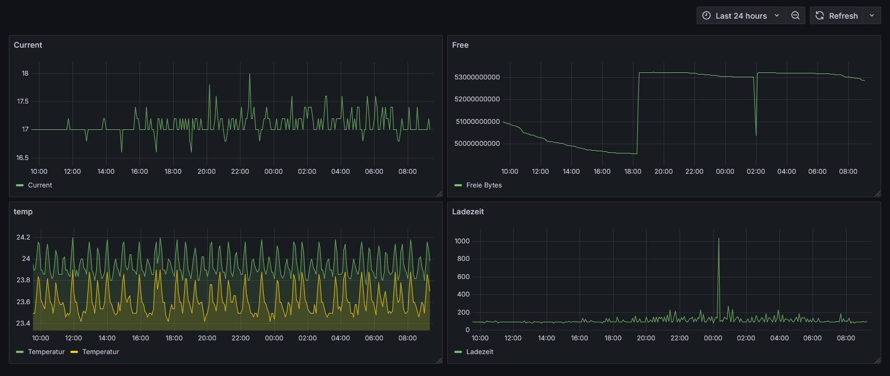

# Grafana data source plugin template

This template is a starting point for building a Data Source Plugin for PRTG.

## What are Grafana data source plugins?

The **PRTG Network Monitor** is a versatile tool for network monitoring. IT teams can use it to monitor the performance and availability of their network components in real-time and identify issues early. With its wide range of features, PRTG Network Monitor enables IT administrators to efficiently manage their network infrastructure and ensure smooth operation.

A new data source is to be developed in a **Grafana plugin**, allowing data to be extracted from the **PRTG REST API** and displayed in dashboards using Grafana’s visualization options. The implementation will be carried out in **JavaScript (Node.js)** and **React** for the user interface to ensure a modern and high-performance integration.

To ensure the functionality of the plugin, it will undergo **comprehensive testing**. Without backend integration, **unit testing** will be conducted using **Jest**, while frontend functions and interactions within the Grafana environment will be tested with **Cypress**. This testing process ensures both data consistency and usability.

The plugin will be developed to be compatible with the **latest version of Grafana (10+)**. Through seamless integration and simple configuration, users will be able to retrieve and visualize their **PRTG data** in just a few steps. A successful testing process not only confirms the technical functionality but also ensures a **positive user experience**.

## Distributing your plugin

When distributing a Grafana plugin either within the community or privately the plugin must be signed so the Grafana application can verify its authenticity. This can be done with the `@grafana/sign-plugin` package.

_Note: It's not necessary to sign a plugin during development. The docker development environment that is scaffolded with `@grafana/create-plugin` caters for running the plugin without a signature._

## Initial steps

Before signing a plugin please read the Grafana [plugin publishing and signing criteria](https://grafana.com/legal/plugins/#plugin-publishing-and-signing-criteria) documentation carefully.

`@grafana/create-plugin` has added the necessary commands and workflows to make signing and distributing a plugin via the grafana plugins catalog as straightforward as possible.

Before signing a plugin for the first time please consult the Grafana [plugin signature levels](https://grafana.com/legal/plugins/#what-are-the-different-classifications-of-plugins) documentation to understand the differences between the types of signature level.

1. Create a [Grafana Cloud account](https://grafana.com/signup).
2. Make sure that the first part of the plugin ID matches the slug of your Grafana Cloud account.
   - _You can find the plugin ID in the `plugin.json` file inside your plugin directory. For example, if your account slug is `acmecorp`, you need to prefix the plugin ID with `acmecorp-`._
3. Create a Grafana Cloud API key with the `PluginPublisher` role.
4. Keep a record of this API key as it will be required for signing a plugin

## Signing a plugin

### Using Github actions release workflow

If the plugin is using the github actions supplied with `@grafana/create-plugin` signing a plugin is included out of the box. The [release workflow](./.github/workflows/release.yml) can prepare everything to make submitting your plugin to Grafana as easy as possible. Before being able to sign the plugin however a secret needs adding to the Github repository.

1. Please navigate to "settings > secrets > actions" within your repo to create secrets.
2. Click "New repository secret"
3. Name the secret "GRAFANA_API_KEY"
4. Paste your Grafana Cloud API key in the Secret field
5. Click "Add secret"

#### Push a version tag

To trigger the workflow we need to push a version tag to github. This can be achieved with the following steps:

1. Run `npm version <major|minor|patch>`
2. Run `git push origin main --follow-tags`

## Dashboard Provisioning

### Reusable Dashboard URLs

When provisioning dashboards, the system uses dashboard UIDs to maintain stable URLs across different Grafana instances. Key points:

- Dashboard UIDs in JSON files are preserved during provisioning
- URLs remain stable when migrating between Grafana instances
- Avoid reusing the same UID within an installation
- Avoid using duplicate dashboard titles within the same folder

**Note:** The `keepProvisionedDashboardUids` option in `dashboards.yml` ensures URL stability during provisioning.

### Folder Structure

The plugin supports automatic folder creation based on filesystem structure. Example structure:

## Learn more

Below you can find source code for existing app plugins and other related documentation.

- [Basic data source plugin example](https://github.com/grafana/grafana-plugin-examples/tree/master/examples/datasource-basic#readme)
- [`plugin.json` documentation](https://grafana.com/developers/plugin-tools/reference/plugin-json)
- [How to sign a plugin?](https://grafana.com/developers/plugin-tools/publish-a-plugin/sign-a-plugin)

## [See please docs ordner for details](./docs/config/ConfigEditor.md)

## For example for the panel

