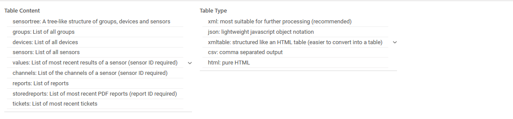

# PRTG Data Source Plugin for Grafana

A Grafana data source plugin for integrating PRTG Network Monitor metrics into your Grafana dashboards.

## Project Overview

This plugin enables seamless integration between PRTG Network Monitor and Grafana, allowing users to visualize and analyze PRTG sensor data using Grafana's powerful visualization and alerting capabilities.

## Development

### Prerequisites

- Node.js 16+
- Grafana 10.0+
- PRTG Network Monitor instance for testing

### Getting Started

1. Clone this repository:

   ```bash
   git clone https://github.com/1DeliDolu/maxmarkusprogram-prtg-datasource.git
   ```
2. Install dependencies:

   ```bash
   npm install
   ```
3. Build the plugin:

   ```bash
   npm run build
   ```
4. Start development server:

   ```bash
   npm run dev
   ```

## Contributing

Contributions are welcome! Please feel free to submit a Pull Request. For major changes, please open an issue first to discuss what you would like to change.

1. Fork the repository
2. Create your feature branch (`git checkout -b feature/AmazingFeature`)
3. Commit your changes (`git commit -m 'Add some AmazingFeature'`)
4. Push to the branch (`git push origin feature/AmazingFeature`)
5. Open a Pull Request

## License

This project is licensed under the Apache 2.0 License - see the [LICENSE](LICENSE) file for details.

## Support

For bug reports and feature requests, please use the GitHub issues system.<!-- This README file is going to be the one displayed on the Grafana.com website for your plugin. Uncomment and replace the content here before publishing.

Remove any remaining comments before publishing as these may be displayed on Grafana.com -->

## Read please [docs ordner](../docs/config/ConfigEditor.md) for details and setting

## API Calls for Historic Data

The API calls for historic data tables look like this:

### Historic data in JSON format:

<pre><b>/api/historicdata.json</b>?id=objectid&avg=0&sdate=2025-01-20-00-00-00&edate=2025-01-21-00-00-00&usecaption=1</pre>

# Common Parameters for Historic Data API Calls

The following parameters can be used for the graphs and the data tables:

| **Parameter** | **Description**                                                                                   | **Possible values**         |
| ------------------- | ------------------------------------------------------------------------------------------------------- | --------------------------------- |
| id                  | ID of the specific sensor                                                                               | integer value                     |
| sdate               | Start of the time span (date and time)                                                                  | yyyy-mm-dd-hh-mm-ss               |
| edate               | End of the time span (date and time)                                                                    | yyyy-mm-dd-hh-mm-ss               |
| avg                 | Average interval in seconds; use 0 to download raw data (= results of all single monitoring requests)   | integer value                     |
| width/height        | Width and height of the graph in pixels                                                                 | integer value                     |
| graphstyling        | baseFontSize='x' sets the size of the font, showLegend='x' enables (1) or disables (0) the graph legend | baseFontSize='x'%20showLegend='x' |

## Getting One Single Property or Status of an Object

You can get properties/settings of an object (name,hostname, url) as well as status information of an object (lastvalue,
downtime) using the following API calls:

#### Get object property/setting (for propertyname look at the "name" of the INPUT fields while editing an object):

<pre><b>/api/getobjectproperty.htm</b>?id=objectid&name=propertyname&show=text</pre>

#### Get object status (for columnname refer to the "Supported Output Columns" table below):

<pre><b>/api/getobjectstatus.htm</b>?id=objectid&name=columnname&show=text</pre>

The XML result looks like this:

```
    <?xml version="1.0" encoding="UTF-8" ?>
    <prtg>
        <version>25.1.102.1373+</version>
        <result>True</result>
    </prtg>
```

#### Get details about a sensor in XML:

<pre><b>/api/getsensordetails.xml</b>?id=sensorid </pre>

#### Get details about a sensor in JSON:

<pre><b>/api/getsensordetails.json</b>?id=sensorid </pre>

The XML result looks like this:

```
    <?xml version="1.0" encoding="UTF-8"?>
    <sensordata>
        <prtg-version>25.1.102.1373+</prtg-version>
        <name>
            <![CDATA[Probe Health]]>
        </name>
        <sensortype>
            <![CDATA[Probe]]>
        </sensortype>
        <interval>
            <![CDATA[60 s]]>
        </interval>
        <probename>
            <![CDATA[PRTG]]>
        </probename>
        <parentgroupname>
            <![CDATA[PRTG]]>
        </parentgroupname>
        <parentdevicename>
            <![CDATA[Probe.Device.]]>
        </parentdevicename>
        <parentdeviceid>
            <![CDATA[40]]>
        </parentdeviceid>
        <lastvalue>
            <![CDATA[99 %]]>
        </lastvalue>
        <lastmessage>
            <![CDATA[OK]]>
        </lastmessage>
        <favorite>
            <![CDATA[]]>
        </favorite>
        <statustext>
            <![CDATA[Up]]>
        </statustext>
        <statusid>
            <![CDATA[3]]>
        </statusid>
        <lastup>
            <![CDATA[40511.5501967593[20 s ago]]]>
        </lastup>
        <lastdown>
            <![CDATA[40511.5407662153[13 m 55 s ago]]]>
        </lastdown>
        <lastcheck>
            <![CDATA[40511.5501967593[20 s ago]]]>
        </lastcheck>
        <uptime>
            <![CDATA[99.9639%]]>
        </uptime>
        <uptimetime>
            <![CDATA[283 d 14 h]]>
        </uptimetime>
        <downtime>
            <![CDATA[0.0361%]]>
        </downtime>
        <downtimetime>
            <![CDATA[2 h 27 m 31 s]]>
        </downtimetime>
        <updowntotal>
            <![CDATA[283 d 16 h [=63% coverage]]]>
        </updowntotal>
        <updownsince>
            <![CDATA[40059.3436475810[452 d 4 h ago]]]>
        </updownsince>
    </sensordata>

```

## Getting Property or Status of Multiple Objects

Most data that you can request from the API is available in data tables in XML and CSV format (using XML format is recommended).

The API function  **/api/table.xml **   is used to access data in tables. Here are some sample calls (URLs are shown without authentication parameters to improve readability):

### A hierarchical list of all groups, devices, and sensors with their current state information:

<pre><b>/api/table.xml</b>?content=sensortree</pre>

**Note:** *sensortree* does not support JSON output.

All sensors (with current status information):

<pre><b>/api/table.xml</b>?content=sensors&columns=objid,group,device,sensor,status,message,lastvalue,priority,favorite</pre>

All recent log entries:

<pre><b>/api/table.xml</b>?content=messages&columns=objid,datetime,parent,type,name,status,message</pre>

You will have the easiest start if you either use the table query builder below or click the
icon that most tables with data have in the PRTG web interface. Simply navigate to the information that you want to use, click the XML icon, and you will be taken to a URL that renders the content of the table in XML format. You can now use the URL as it is or change various parameters (see parameter
description below) to suit your needs.

**Note:** URLs only show the XML URLs, please use API function /api/table.csv or the "output" parameter to select CSV format.

For more information on possible raw message status values returned by table-based API calls, see the Knowledge Base: [https://kb.paessler.com/en/topic/76501


](https://kb.paessler.com/en/topic/76501?utm_source=prtg&utm_medium=referral&utm_campaign=webgui-kb)

# PRTG HTTP API: Table Query Builder

You can use the following query builder tool to experiment with the API and to fine tune your queries. Please consult the
information below for details:

### Table Query Builder

Please choose from the available contents for tables



Read please [ PRTG Single Object Status](https://www.paessler.com/manuals/prtg/single_object_status) for details.
